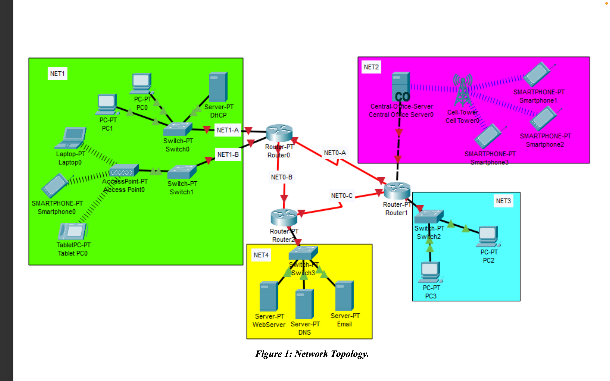

# Cisco-Packet-Tracer

## 📸 Project Topology

---

## 📋 Project Summary

This project simulates a multi-area IP network in Cisco Packet Tracer involving subnetting, OSPF routing, DHCP, DNS, web, and email services. The topology connects five areas (Core, University, Street, Home, Datacenter) and supports wired, wireless, and 3G/4G connectivity across various devices.

---

## 🧱 Network Structure

- **Area 0: Core Network**
  - 3 routers forming the backbone
  - Point-to-point links (NET0-A, NET0-B, NET0-C)

- **Area 1: University Network**
  - NET1-A (Wired): 2 PCs via switch, DHCP server
  - NET1-B (Wireless): Access Point connected to a laptop, tablet, and smartphone

- **Area 2: Street Network**
  - Router connected to a Central Office (CO) Server and a Cell Tower
  - 3 smartphones accessing via 3G/4G

- **Area 3: Home Network**
  - 2 PCs connected via switch

- **Area 4: Datacenter**
  - 3 servers: Web, DNS, Email

---

## 📌 Key Implementations

### 🔢 Subnetting
- Custom subnetting based on the last four digits of the team leader's SID.
- Each subnetwork was allocated IP ranges according to device requirements.
- Reserved space for future expansion and network clarity.

### 📡 Wireless & Mobile Access
- University Area includes secure wireless access with WPA2-AES.
- Street Area uses a simulated 3G/4G network via Cell Tower to smartphones.

### 🌐 Services
- **Web Server**:
  - Hosts `www.coe.birzeit.edu`
  - Custom HTML page with titles, team description, and styling

- **Email Server**:
  - Domain: `coe.birzeit.edu`
  - SMTP + POP3 enabled
  - 3 user accounts for team members (HomeSID, StreetSID, UniversitySID)

- **DNS Server**:
  - Resolves both A and CNAME records
  - Supports web and mail domain name resolution

### 🔁 OSPF Routing
- Configured with **5 areas**, each matching one of the project zones.
- Wildcard masks used to assign router interfaces to areas.
- All routers synchronized with router IDs and adjacency relationships validated.

---
### 📊 Subnetting Plan Table 

| Network      | Subnetwork | Network IP     | CIDR | Broadcast IP   | First Host IP    | Last Host IP     |
|--------------|------------|----------------|------|----------------|------------------|------------------|
| University   | NET1-A     | 101.75.8.0     | /26  | 101.75.8.63    | 101.75.8.1       | 101.75.8.62      |
| University   | NET1-B     | 101.75.8.64    | /26  | 101.75.8.127   | 101.75.8.65      | 101.75.8.126     |
| Street       | NET2       | 101.75.8.128   | /27  | 101.75.8.159   | 101.75.8.127     | 101.75.8.158     |
| Home         | NET3       | 101.75.8.160   | /27  | 101.75.8.191   | 101.75.8.161     | 101.75.8.190     |
| Datacenter   | NET4       | 101.75.8.192   | /27  | 101.75.8.223   | 101.75.8.193     | 101.75.8.222     |
| Core         | NET0-A     | 101.75.8.224   | /30  | 101.75.8.226   | 101.75.8.225     | 101.75.8.226     |
| Core         | NET0-B     | 101.75.8.228   | /30  | 101.75.8.231   | 101.75.8.229     | 101.75.8.230     |
| Core         | NET0-C     | 101.75.8.232   | /30  | 101.75.8.235   | 101.75.8.233     | 101.75.8.234     |

---

## 🛠️ Tools Used

- **Cisco Packet Tracer (v8.x)**

